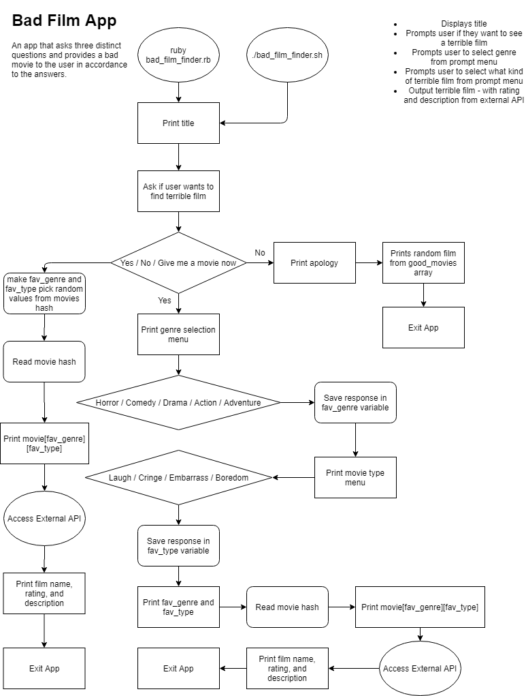

Github Link: https://github.com/OldsterJoey/bad_film_finder

## Statement of Purpose and Scope

My terminal application is being designed to supply its audience with the most appropriate terrible movie, per answers provided within a simple three-step questionnaire. The questionnaire will ask three simple questions: if the user wants to watch a terrible movie, what genre the movie should be, and whether the user wants to laugh, cringe, embarrass themselves with friends, or die of boredom. The app will then output a movie following the answers provided, retrieving information from numerous film hashes, linked to a movie identification number that will allow access to a description and rating of whatever film is outputted. The selection of films will be chosen and coded in by me, as to ensure the user has a tailored experience.

For many people, finding the perfect movie to watch can be found using numerous online tools and websites. However, for the niche audience of people who instead want to seek out a movie they'll enjoy the least or one they can make their own fun from, there appears to be a gap in helpful tools for this purpose. My application is designed specifically to fill that gap, and allow users to find films that they'll hate, laugh at (not with) or visibly cringe to. As a bad film lover myself, I realise that bad movies can be bad for a large variety of reasons, whether it be that the film is mind-numbingly boring, or cringe-inducing. I want to create a tool that can separate these different bad movie types to find the most personalized bad film for an individual possible, utilising my knowledge of each film.

This application will be tailored towards the needs of an audience that enjoys and actively seeks out bad movies, as opposed to a general film-watching audience, and will be presented in a way that does not take itself too seriously. The app is meant to be used for fun, so it should also show within the design. The app will be extremely streamlined and simple to use, with built-in menus to make the app a very streamlined and user-friendly experience no matter what level of computer knowledge you have.

## Features

The core feature of my app is its use of an external API that will give access to an external description and rating of whatever film is outputted to the user. This API will give access to a movie database, which will print relevant information based on an external identification number linked to each film retrieved from major film sites such as IMDb. This ID will allow access to a large variety of information for each film, such as aggregate scores and reviews, which can be implemented very easily if I choose to do so.

My app will also feature the use of an interactive selection prompt menu, created using TTY-Prompt, a part of a larger toolkit of many different components usable within a terminal application. This interactive menu will create a very appealing user experience, as it will effectively cut out any need for computer knowledge from the user. All selections within the app will be visibly seen as self-explanatory buttons the user can select, and each selection will provide user feedback so there is no possibility for feeling lost within the app. This feature also cuts out a lot of possibility for error within the code, as all selections are predefined and not typed by the user.

If there ever is a case where the application is unable to access data for the movie, whether it be due to being unable to access the internet, the movie id number being changed by the database, or error within the source code, the application will still be able to print the movies name, along with a user-friendly error informing the user the application is unable to access the movies information. The loop will then continue as normal. As all film names will be hardcoded in, the app can still function offline, just with fewer features. 

## User Interaction Outline

 - Displays application title
- Begins questionnaire loop
- Prompts user if they want to watch a terrible film - Yes / No / Give me a movie now
-- No - Display quit message, print out random award winning film
-- Give me a movie now - Bypass questionnaire, save favourite genre and favourite movie type as randomised values and print a film
-- Yes - Continue through loop
- Prompts user to select genre from prompt menu - Horror / Comedy / Drama / Action / Adventure
-- Save user selection as favourite genre variable
- Prompts user to select what kind of terrible film from prompt menu - Laugh / Cringe / Embarrass / Boredom
-- Save users selection as favourite movie type variable
- Output terrible film - with rating and description from external API
- Prompts user if they would like to start again Yes / No
-- Yes - Loop back to start
-- No - Print goodbye message and quit application

## Control Flow Diagram

Original Diagram

Diagram Updated with tty-prompt and Movie Database API in mind 

## Implementation Plan

[Trello Board Link](https://trello.com/b/RQjT2xB3/bad-film-finder)

## Installation Guide

### External requirements

A Movie Database API Key is required for application usage. In order to retrieve this key you must make an account at [The Movie Database](https://www.themoviedb.org/) (https://www.themoviedb.org/), and follow the guide within this [Documentation](https://developers.themoviedb.org/3/getting-started/introduction) (https://developers.themoviedb.org/3/getting-started/introduction). API key must then be saved in a new file within app directory named 'credentials.json', in the format of {"api_key":"**YOUR API KEY GOES HERE**"}

### Gem Dependancies

gem 'tty', '~> 0.7.0'

gem 'rspec', '~> 3.10'

gem 'rainbow', '~> 3.0'

gem 'lolize', '~> 0.0.3'

gem 'faraday', '~> 1.1'

### Accessing required Gems

Use 'bundle install' command to install all necessary gems for app usage. All Gems can be found within Gemfile 

### Running the application

Bash script 'bad_film_finder.sh' included, permissions may need to be changed to execute.
Alternatively, use 'bad_film_finder.rb' command to launch

### Command Line Arguments

-help:

Refers to README

-info:

Prints Ruby version

&nbsp;

&nbsp;

**Special thanks to Rubocop Gem for doing my cleanup duty**

